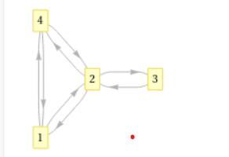
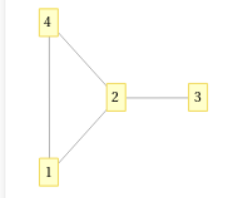

覚える必要のあるとこ＆その理由
# 大問1
(a) 正
整列すると二分探索とかがつかえるから

(b) 正
挿入ソートは挿入一つ一つがO(N),挿入の数がO(N)あるのでO(N^2)

(c) 正
そのまま

(d) 正
最悪のデータケースの場合、二分探索木で一番下の葉にたどり着くまでに木の高さ分移動するから。

(e) 誤
二分探索木にデータの偏りがあると二分探索木の並びが直線状になってしまうから。

(f) 正
ハッシュはキーとそれを入れる領域を1対1に対応付ける必要があるので、対応がずれる（衝突する）のは防がないといけない。

(g) 正
1→2という辺と2→1という辺があったらループ

(h) 誤
両方向な有向グラフとして見ればいい。
| | | | |
|:-:|:-:|:-:|:-:|
| 1 | 2 | 4 |
| 2 | 1 | 3 | 4 |
| 3 | 2 |
| 4 | 1 | 2 |

(i) 正
一度訪れたことを記憶しないと、二つの頂点で無限に行ったり来たりしてしまう。

(j) 誤
小さい問題の解を使って大きい問題を解くのが動的計画法

# 大問2
マージソート O(NlogN)

線形探索 O(N)

二分探索 O(logN)

衝突のないハッシュ O(1)

スタックのpop O(1)

キューのpop O(1)

連結リストの先頭に挿入 O(1)

連結リストの要素の検索 O(N)

木に対する深さ優先探索 O(N)

#### おまけ
クイックソート O(NlogN)

マージソート O(NlogN)

ヒープソート O(NlogN)

挿入ソート O(N^2)

選択ソート O(N^2)

バブルソート O(N^2)

スタック、キューの取り出し入れ O(1)

連結リストのN番目の要素にアクセス O(N)

連結リストの先頭への挿入、削除 O(1)

# 大問3
(a) 連鎖行列積 AOJ_ALDS1_Lesson10_B

区間[l,r)の答えをそれより小さい区間の答えを用いて計算するから

(b) 逆ポーランド記法 AOJ_ALDS1_Lesson3_A

そのまま

(c) 最長共通部分列 AOJ_ALDS1_Lesson10_C

文字列Sをi文字目まで、文字列Tをj文字目までの最長共通部分列をそれより小さい範囲の答えを用いて計算するから

(d) クイックソート AOJ_ALDS1_Lesson6_B

小さいグループと大きいグループに分けてソートするから

(e) 深さ優先探索はスタック

探索する頂点をスタックに入れるとすると、真っ先に取り出すのは最後に入れた頂点だから。

(f) 幅優先探索はキュー

探索する頂点をキューに入れるとすると、真っ先に取り出すのは最初に入れた頂点だから。

(g) 連想配列はハッシュ

文字列をキーとすると文字列をハッシュ関数で数値にしないと格納する場所を決められないから。

(h) 二分探索木が満たす条件

二分探索木のある部分木の根をxとすると

左部分木のキー <= xのキー

右部分木のキー >= xのキー

となるようにしなければならない。

(i) クイックソートの欠点

クイックソートは入力データによって時間計算量がO(N^2)となってしまう。

(j) 安定なソートとは

同じ値を持つ要素の前後がソート前とソート後で変化していないソートのこと。
